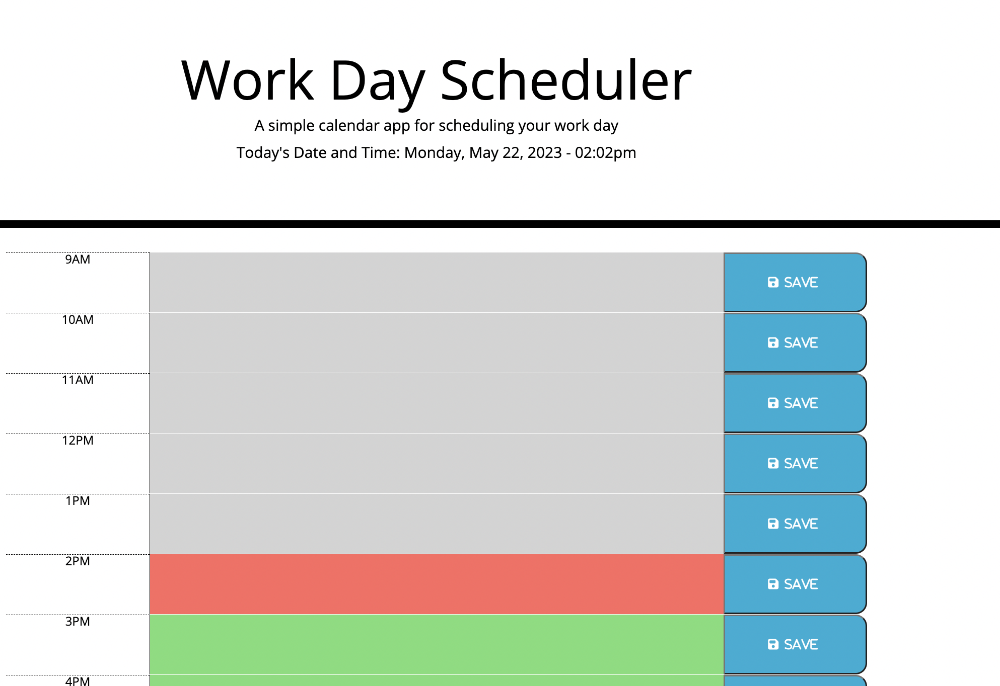

# homework-05-work-scheduler
Third Party API Challenge - work scheduler

Git Hub: https://github.com/minutemin/Third-Party-API-work-scheduler

Git Pages: https://minutemin.github.io/Third-Party-API-work-scheduler/

## Description ##

HOMEWORK 05 - THIRD PARTY API CHALLENGE - The Work Day Scheduler

This assignment we had to finish a code for a work day scheduler.  Eight hours were added to the scheudle.  

## Usage

When I click on the text area of the hour, it will log it in my local storage.  When I refresh the page, the items logged in local storage will still be there.  

The calendar also is color coded, and has different colors for showing different times of the schedule.  It is light grey if the hour has past, red for the current hour, and green for the future hours.  

## License

Licensed under the MIT license.
